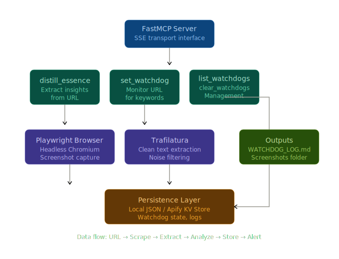

# 🛰 TRITIUM-Watcher

<div align="center">
  
  

**TRITIUM-Watcher** is a **professional-grade research tool** designed for autonomous web monitoring, smart content extraction, and real-time alerts. It transforms your AI assistant into a proactive research agent capable of watching the web for you, distilling complex information, and providing visual evidence when specific events occur.

  [](https://www.python.org/downloads/)
  [](https://github.com/jlowin/fastmcp)
  [](https://github.com/Aarav482011/TRITIUM-Watcher/stargazers)
  
  [Features](#-core-capabilities) • [Installation](#-local-setup) • [Usage](#-available-research-tools) • [Deployment](#️-deployment)
</div>

## 📜 License

**AGPLv3**


## Architecture
<div align="center">
  


## ⚡ Quick Start

Get TRITIUM-Watcher running in under 5 minutes.

### 📦 Installation

**Step 1: Clone and navigate**
```bash
git clone https://github.com/A-Solo-Engineer/TRITIUM-Watcher.git
cd TRITIUM-Watcher
```

**Step 2: Create virtual environment**
```bash
# Windows
python -m venv venv
.\venv\Scripts\activate

# macOS/Linux
python3 -m venv venv
source venv/bin/activate
```

**Step 3: Install dependencies**
```bash
pip install -r requirements.txt
playwright install chromium
```

**Step 4: Launch**
```bash
python tritium_watcher.py
```

✅ **You're ready!** TRITIUM-Watcher is now running as an MCP server.

---

### 🎯 Try It Out

#### **Use Case 1: Track Competitor Price Changes**
```
Set up a watchdog on https://competitor.com/pricing for keywords: discount, sale, price drop, new plan
```
→ Get instant alerts when they change pricing

#### **Use Case 2: Monitor News for Your Industry**
```
Set up a watchdog on https://techcrunch.com/ai for keywords: regulation, breakthrough, funding round
```
→ Stay ahead of industry developments

#### **Use Case 3: Track Product Launches**
```
Set up a watchdog on https://apple.com for keywords: available now, pre-order, shipping
```
→ Never miss a launch announcement

#### **Use Case 4: Extract Key Points from Research Papers**
```
Use distill_essence on https://arxiv.org/abs/2024.12345
```
→ Get the 5 most important insights instantly

---

### 📊 How to View Results

**Check your alerts:**
```bash
# Open the watchdog log
cat WATCHDOG_LOG.md

# Or open it in your browser/editor
```

**What you'll see:**
- 📸 **Screenshots** with matched keywords highlighted in red
- 🕐 **Timestamps** of when matches occurred
- 🔗 **Direct links** to the pages

---

### 🛠️ Common Commands

| What You Want | Command Example |
|--------------|----------------|
| Extract insights | `distill_essence("https://example.com")` |
| Start monitoring | `set_watchdog("https://site.com", "keyword1, keyword2")` |
| List watchdogs | `list_watchdogs()` |
| Stop all watchdogs | `clear_watchdogs()` |

---

### 🚨 Troubleshooting

<details>
<summary><b>❌ Playwright won't install</b></summary>
```bash
# Try with dependencies
playwright install chromium --with-deps

# Or use system chromium (Linux)
sudo apt install chromium-browser
```
</details>

<details>
<summary><b>❌ Port already in use</b></summary>
```bash
# Windows
taskkill /F /IM python.exe

# macOS/Linux  
pkill -f tritium_watcher

# Then restart
python tritium_watcher.py
```
</details>

<details>
<summary><b>❌ Module not found errors</b></summary>
```bash
# Make sure virtual environment is activated
# Windows: .\venv\Scripts\activate
# Mac/Linux: source venv/bin/activate

# Reinstall requirements
pip install -r requirements.txt --upgrade
```
</details>

**Still stuck?** [Open an issue](https://github.com/A-Solo-Engineer/TRITIUM-Watcher/issues) or email admin.forestritium@gmail.com

---

### 🚀 Next Steps

- **Deploy to Cloud**: See [Deployment Guide](#️-deployment) for Apify setup
- **Configure Intervals**: Edit check frequency in the code
- **Add Webhooks**: Set up notifications (coming soon)
- **Explore API**: Integrate with your own tools

---


## 🚀 Core Capabilities

-   **Smart Distillation**: Bypasses "web noise" (ads, headers, footers) to extract the most statistically significant data points from any URL using advanced text analysis.
-   **Persistent Watchdogs**: Monitors multiple URLs in the background for custom keywords. These watchdogs are persistent and survive restarts.
-   **Visual Alerts**: Automatically captures screenshots when keywords are matched, highlighting the evidence in red for immediate verification.
-   **Cloud-Native Architecture**: Fully "Apify Ready" with Docker support and automatic cloud persistence via Apify Key-Value Stores.

## 🛠 Available Research Tools

### `distill_essence`
Scrapes a URL and returns the 5 most important sentences or data points, filtering out navigation and promotional content.
- **Input**: `url` (string)
- **Output**: List of key insights.

### `set_watchdog`
Deploys a background monitor on a URL to check for specific keywords at regular intervals.
- **Input**: `url` (string), `keywords` (comma-separated string)
- **Output**: Confirmation message.
- **Visuals**: Matches are logged to `WATCHDOG_LOG.md` with screenshot links.

### `list_watchdogs`
Displays all currently active monitoring tasks managed by this **professional-grade research tool**.

### `clear_watchdogs`
Stops all active monitoring tasks and wipes the persistence store.

## 💻 Local Setup

1.  **Clone the repository** to your local machine.
2.  **Initialize the environment**:
    ```powershell
    python -m venv venv
    .\venv\Scripts\activate
    pip install -r requirements.txt
    playwright install chromium
    ```
3.  **Run the tool**:
    ```powershell
    .\venv\Scripts\python.exe tritium_watcher.py
    ```

## ☁️ Deployment 

This tool is optimized for deployment as an Apify Actor:
1.  Push the code to GitHub.
2.  Connect your GitHub repo to an Apify Actor.
3.  The tool will automatically detect the Apify environment and use **Apify Key-Value Store** for persistence.

## ⚙️ Technical Details

-   **Framework**: FastMCP (v2)
-   **Transport**: Streamable HTTP (SSE)
-   **Scraping**: Playwright & Trafilatura
-   **Persistence**: Hybrid (Local JSON / Apify Key-Value Store)
-   **Logging**: Silent terminal operation; all alerts logged to `WATCHDOG_LOG.md`.

## 📄 Compliance & Support

This **professional-grade research tool** is designed to meet the requirements for listing on the GitHub Marketplace.

### Pricing
- **Free Plan**: Unlimited local use and basic background monitoring.
- **Pro Plan (Coming Soon)**: Enhanced monitoring frequency and cloud-based alert notifications.

### Support
For any issues, feature requests, or security concerns, please reach out through our support channels:
- **Support Link**: [Submit an Issue](https://github.com/A-Solo-Engineer/TRITIUM-Watcher/issues)
- **Email**: admin.forestritium@gmail.com
- **Status Page**: [GitHub Status](https://github.com/A-Solo-Engineer/TRITIUM-Watcher)

### Legal
- **Privacy Policy**: [Read our Privacy Policy](PRIVACY.md)
- **Terms of Service**: [Read our Terms of Service](TERMS.md)
- **Contact**: For business inquiries, contact admin.forestritium@gmail.com

---
*Note:STILL IN DEVELOPMENT PHASE AND IMPROVING RAPIDLY*
