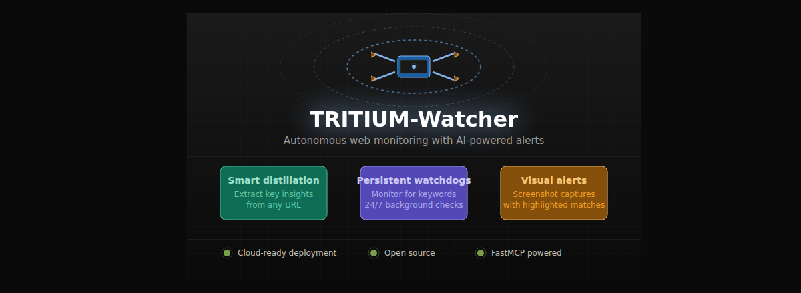

# 🛰 TRITIUM-Watcher

<div align="center">
  
  

**TRITIUM-Watcher** is a **professional-grade research tool** designed for autonomous web monitoring, smart content extraction, and real-time alerts. It transforms your AI assistant into a proactive research agent capable of watching the web for you, distilling complex information, and providing visual evidence when specific events occur.

## 🚀 Core Capabilities

-   **Smart Distillation**: Bypasses "web noise" (ads, headers, footers) to extract the most statistically significant data points from any URL using advanced text analysis.
-   **Persistent Watchdogs**: Monitors multiple URLs in the background for custom keywords. These watchdogs are persistent and survive restarts.
-   **Visual Alerts**: Automatically captures screenshots when keywords are matched, highlighting the evidence in red for immediate verification.
-   **Cloud-Native Architecture**: Fully "Apify Ready" with Docker support and automatic cloud persistence via Apify Key-Value Stores.

## 🛠 Available Research Tools

### `distill_essence`
Scrapes a URL and returns the 5 most important sentences or data points, filtering out navigation and promotional content.
- **Input**: `url` (string)
- **Output**: List of key insights.

### `set_watchdog`
Deploys a background monitor on a URL to check for specific keywords at regular intervals.
- **Input**: `url` (string), `keywords` (comma-separated string)
- **Output**: Confirmation message.
- **Visuals**: Matches are logged to `WATCHDOG_LOG.md` with screenshot links.

### `list_watchdogs`
Displays all currently active monitoring tasks managed by this **professional-grade research tool**.

### `clear_watchdogs`
Stops all active monitoring tasks and wipes the persistence store.

## 💻 Local Setup

1.  **Clone the repository** to your local machine.
2.  **Initialize the environment**:
    ```powershell
    python -m venv venv
    .\venv\Scripts\activate
    pip install -r requirements.txt
    playwright install chromium
    ```
3.  **Run the tool**:
    ```powershell
    .\venv\Scripts\python.exe tritium_watcher.py
    ```

## ☁️ Deployment 

This tool is optimized for deployment as an Apify Actor:
1.  Push the code to GitHub.
2.  Connect your GitHub repo to an Apify Actor.
3.  The tool will automatically detect the Apify environment and use **Apify Key-Value Store** for persistence.

## ⚙️ Technical Details

-   **Framework**: FastMCP (v2)
-   **Transport**: Streamable HTTP (SSE)
-   **Scraping**: Playwright & Trafilatura
-   **Persistence**: Hybrid (Local JSON / Apify Key-Value Store)
-   **Logging**: Silent terminal operation; all alerts logged to `WATCHDOG_LOG.md`.

## 📄 Compliance & Support

This **professional-grade research tool** is designed to meet the requirements for listing on the GitHub Marketplace.

### Pricing
- **Free Plan**: Unlimited local use and basic background monitoring.
- **Pro Plan (Coming Soon)**: Enhanced monitoring frequency and cloud-based alert notifications.

### Support
For any issues, feature requests, or security concerns, please reach out through our support channels:
- **Support Link**: [Submit an Issue](https://github.com/Aarav482011/TRITIUM-Watcher/issues)
- **Email**: sparklabs2011@gmail.com
- **Status Page**: [GitHub Status](https://github.com/Aarav482011/TRITIUM-Watcher)

### Legal
- **Privacy Policy**: [Read our Privacy Policy](PRIVACY.md)
- **Terms of Service**: [Read our Terms of Service](TERMS.md)
- **Contact**: For business inquiries, contact www.forestritium.com@gmail.com

---
*Note:STILL IN DEVELOPMENT PHASE AND IMPROVING RAPIDLY*
